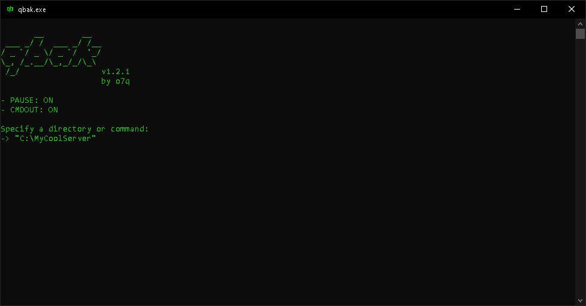

# [>> Downloads](https://github.com/o7q/qbak/releases)
### Welcome! qbak is an ultra-simple and lightweight command-line based backup tool.

<br>



<br>

# Overview
### qbak takes in a directory and auto-configures powershell scripts to do backup tasks using `robocopy`.

<br>

# Usage
qbak is designed to work alongside a batch or console process. To use qbak, add the line `"qbak.exe"` inside of your batch script file. An example could be (minecraft server scenario):
```
@echo off
color a
:a
cd "C:\MyCoolServer"
"java_jdk\bin\java.exe" -Xmx4G -Xms4G -jar "server.jar"
pause
cd "C:"
"qbak.exe"
goto a
pause
```
In this example qbak would backup the specified directory after the server shuts down and a key is pressed.\
qbak can also act as a normal desktop application as in executing it with a double-click.

qbak will remember the directory you specified and it will continually use it unless changed. You can change the directory by running `qbak_reset.bat`, a file which is automatically created after launching qbak. Running `qbak_reset.bat` will cause qbak to ask you to specify a new directory on the next launch.

qbak will organize the backups for you; all backups are housed within the `qbackups` folder, which will be automatically created after launching qbak. The folder structure of a backup will look like this: `qbackups\qbackup.8312022_15374\qbackup`.

qbak will create a log for each backup it makes. The file path for the log will look like this: `qbackups\qbackup.8312022_15374\qbackup0.log`.

<br>

## <b>Commands</b>
To use a command, simply enter it after the `->` pointer.
Inserting a `!` before a command tag will disable that command. For example: `$`<b>!</b>`PAUSE`

`$INFO` Displays program info\
`$PAUSE` Enables the pausing of the operation after it completes instead of closing\
`$CMDOUT` Enables command outputs after the operation completes (works best when `$PAUSE` is enabled)\
`$PURGE` Destroys all backups, this command is very dangorous and it will prompt you before executing\
`$EXIT` Exits qbak properly

<br>

<i>Programmed with C++ and compiled using MinGW G++</i>